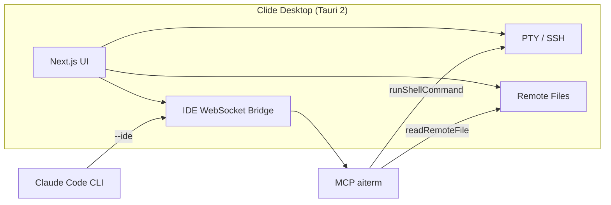

<p align="center">
  
</p>

<p align="center">
  <a href="README.md"></a>
  &nbsp;
  <a href="README_ZH.md"></a>
</p>

<h1 align="center">Clide</h1>

<p align="center">
  <em>Production-grade <strong>AI terminal</strong> for server ops — SSH, SFTP, jump hosts, and native Claude Code. Credentials stay in your shell, not in the chat</em>
</p>

<p align="center">
  <a href="https://github.com/DLbury/clide/releases"></a>
  <a href="https://github.com/DLbury/clide/actions/workflows/release.yml"></a>
  <a href="https://github.com/DLbury/clide/actions/workflows/ci.yml"></a>
  <a href="LICENSE"></a>
  
</p>

<p align="center">
  <a href="https://github.com/DLbury/clide/releases"><strong>⬇️ Download</strong></a>
  &nbsp;·&nbsp;
  <a href="#quick-start">Quick Start</a>
  &nbsp;·&nbsp;
  <a href="#claude-code--mcp-integration">Claude Code</a>
  &nbsp;·&nbsp;
  <a href="#build-from-source">Build</a>
</p>

---

## Overview

**Clide is a production-grade AI terminal** for Windows, macOS, and Linux — multi-tab SSH shells, SFTP, jump hosts, layout snapshots, fleet sync, and resource monitoring, with **native Claude Code integration** built in. The terminal is the interface; AI reads your live PTY and runs commands in the same shell you type in.

Not a chat window with a terminal attached. Passwords, private keys, and sudo prompts **never enter the AI path**.

### Why Clide?

When using Claude Code for server operations, do these security problems sound familiar?

❌ **You must install AI public keys on every server** — one leak compromises them all  
❌ **You must give Claude plaintext passwords** — credentials may leave your machine  
❌ **`sudo` is awkward** — passwordless sudo is a security risk, or you hand root passwords to the AI  

Clide uses a **local relay architecture** to address this:

✅ SSH connections are established and maintained **only on your desktop**  
✅ Passwords and private keys **never leave your computer** or get sent to third parties  
✅ For `sudo`, you type the password in the **left Shell panel** (SSH login uses a local prompt) — **Claude never sees it**  
✅ **No agent software** or extra SSH keys required on remote servers  

Claude Code runs **locally only**. Through **IDE bridge + MCP**, commands go to the **real SSH Shell on the left** (same PTY as manual typing). The AI reads terminal output to help you troubleshoot.

The same window provides multi-session SSH terminals, SFTP file browsing, resource monitoring, and Monaco-based remote config editing — ideal for daily ops, incident response, and change management.

<p align="center">
  
</p>

<p align="center"><strong>Clide</strong> is a production-grade AI terminal — real SSH shells plus native Claude Code, so SREs and backend engineers get AI-driven ops <em>without</em> handing over passwords, private keys, or root.</p>

### 👤 Who is this for?

- **SRE / DevOps / Platform engineers** who run `sudo`, tail logs, and fight incidents on many boxes — and want AI help without exposing credentials.
- **Backend engineers** who SSH into production to debug a service, and want Claude to read the live terminal output alongside you.
- **Security-conscious teams** that can't (or won't) distribute AI public keys to every server or paste root passwords into a chat.

> 🎬 **See it in action** — a 60-second walkthrough of the AI driving the left shell is in [docs/demo-recording.md](docs/demo-recording.md). (Recording slot ready — drop `docs/assets/demo.gif` in place to embed it inline here.)

> Keywords: **ops terminal** · **AI troubleshooting** · **Claude Code** · **MCP** · **SSH** · **secure sudo** · **SRE** · **Tauri desktop app**

### 🔄 How Clide compares

| | SSH client + Claude in another window | Claude Code direct SSH | **Clide** |
|---|---|---|---|
| AI sees live terminal output | ❌ Copy-paste by hand | ✅ Yes | ✅ Yes, same PTY you type in |
| Server credentials | ✅ Stay with you | ❌ Keys on every server or password to AI | ✅ Stay with you — AI never touches them |
| `sudo` / 2FA | ✅ You handle it | ❌ Hard to do safely | ✅ Type in left shell, AI never sees it |
| Agent / extra keys on servers | ✅ None needed | ❌ Required | ✅ None needed |
| One window for shell + files + AI | ❌ No | ⚠️ Partial | ✅ Yes |

Clide keeps the **security model of a traditional SSH client** and adds the **AI context of direct Claude Code SSH** — without the credential exposure.

---

## Table of Contents

- [Features](#features)
- [Download & Install](#download--install)
- [Quick Start](#quick-start)
- [Claude Code & MCP Integration](#claude-code--mcp-integration)
- [MCP Tools](#mcp-tools)
- [Architecture](#architecture)
- [Build from Source](#build-from-source)
- [Project Structure](#project-structure)
- [Releases](#releases)
- [Tech Stack](#tech-stack)
- [License](#license)

---

## Features

### Terminal core

<table>
<tr>
<td width="50%" valign="top">

**SSH terminal**

- Multi-tab shells, Dockview split layout, session groups
- xterm.js live PTY (local PowerShell / remote SSH)
- **Layout snapshots** — save/restore full workspace with per-shell cwd; auto-reconnect on load
- **Multi-server sync** — broadcast keystrokes & paste to all selected servers in one tab
- Command history, **terminal recording** (asciicast export)
- Panel layout memory (sidebar, file tree, AI pane)

</td>
<td width="50%" valign="top">

**Connectivity & fleet ops**

- **Multi-hop jump hosts** (ProxyJump) with per-hop credentials
- SOCKS proxy, Telnet
- Persisted server profiles, auto local shell on startup
- **Windows portable zip** — no-install build alongside setup `.exe`

</td>
</tr>
</table>

### Ops toolkit

<table>
<tr>
<td width="50%" valign="top">

### 📁 Remote Files

- SFTP browse, upload/download
- Drag-and-drop, batch operations
- Root mode (sudo-backed file ops)
- Open/save via Monaco editor

</td>
<td width="50%" valign="top">

### 📊 Resource Monitoring

- CPU, memory, GPU memory, disk after SSH connect
- Separate exec channel — does not block PTY

</td>
</tr>
</table>

### AI copilot (built-in)

<table>
<tr>
<td width="50%" valign="top">

### 🤖 Claude Code & multi-backend AI

- **Claude Code**, Codex, OpenCode, Cursor Agent — switch in settings
- Local CLI + MCP: `runShellCommand` drives the left shell — not direct AI SSH
- Streaming chat, tool calls, terminal output visualization
- **Command approval** before destructive / sensitive commands
- Multi-thread agent conversations; new empty thread on startup when last chat had messages

</td>
<td width="50%" valign="top">

### 🔒 Secure AI boundary

- **Clear password boundary**: SSH/sudo only in left xterm; AI never asks for or embeds passwords
- MCP operates on sessions you already opened — no agent on servers
- Long tasks: poll `getTerminalContext`; optional terminal context injection

</td>
</tr>
</table>

### Recent highlights (v0.1.76+)

| Feature | What it does |
|---------|----------------|
| Layout snapshots | Probe real cwd per shell before save; one-click reconnect + restore splits |
| Multi-server sync | Pick servers → one tab with a shell each → type once, broadcast everywhere |
| Sync group tiling | Auto tile all sync shells on create |
| Panel persistence | Remember collapsed/expanded sidebar, file tree, AI pane |
| Windows portable | `*-portable.zip` — extract and run `clide.exe`, no installer |

<p align="center">
  
  &nbsp;&nbsp;
  
  &nbsp;&nbsp;
  
</p>

---

## Download & Install

Get the latest build from **[Releases](https://github.com/DLbury/clide/releases)**:

| Platform | Format | Notes |
|----------|--------|-------|
| **Windows** | `.exe` installer / `*-portable.zip` | WebView2 required (usually preinstalled on Win10/11). Portable: extract and run `clide.exe` |
| **macOS** | `.dmg` | Separate builds for Apple Silicon (`aarch64`) and Intel (`x86_64`); use **v0.1.21+** (earlier builds had MCP startup issues) |
| **Linux** | `.deb` / `.AppImage` | WebKitGTK and related deps (see [Linux troubleshooting](#linux-troubleshooting)) |

### Linux troubleshooting

> **`.deb` v0.1.20 and earlier**: If the app exits immediately with no window, upgrade to **v0.1.21+** (MCP resource path fix).

If there is **no window** or **click does nothing**, run from a terminal to see errors:

```bash
# After .deb install (binary usually in /usr/bin, assets in /usr/lib/Clide/)
clide

# Or AppImage
chmod +x Clide_*.AppImage
./Clide_*.AppImage
```

Missing libraries on Ubuntu/Debian:

```bash
sudo apt update
sudo apt install -y \
  libwebkit2gtk-4.1-0 \
  libgtk-3-0 \
  libayatana-appindicator3-1
```

On Wayland, try an X11 session or:

```bash
GDK_BACKEND=x11 clide
```

Debug logging:

```bash
RUST_LOG=debug clide
```

### Prerequisites

| Component | Purpose |
|-----------|---------|
| [Claude Code CLI](https://docs.anthropic.com/en/docs/claude-code) | AI chat and MCP tools (Anthropic login required) |
| Node.js 20+ | Source build / MCP stdio scripts only |

---

## Quick Start

1. **Install** — Download Clide from [Releases](https://github.com/DLbury/clide/releases) (Windows: setup `.exe` or portable zip)
2. **Configure SSH** — Add server profiles in the sidebar (host, port, user, key or password — credentials stay in the app, not with the AI)
3. **Connect shell** — Double-click a profile; log in in the **left terminal** (password / 2FA). Use split panes, SFTP, and monitoring
4. **Enable AI** — Install and log in to [Claude Code CLI](https://docs.anthropic.com/en/docs/claude-code); confirm IDE bridge is ready in the sidebar
5. **Ops with AI** — Describe the issue to the AI, e.g. “check disk and load on this machine”; Claude calls `runShellCommand`; you see command and output on the left; enter `sudo` password in the shell when needed

```
Example:
  You: This machine is almost out of disk — help me investigate
  AI:  → runShellCommand("df -h") → runs in left shell, output returned
  AI:  → runShellCommand("sudo du -sh /var/* | sort -rh | head")
  You: Type sudo password in left shell (AI cannot see it)
```

---

## Claude Code & MCP Integration

Clide is a **local ops copilot**: it does not hold SSH credentials; MCP operates on shell sessions you already opened.

| | Claude Code direct SSH | Clide |
|---|------------------------|-------|
| Where Claude runs | Local or on each server | **Local only** |
| Server credentials | Keys everywhere or password to AI | **You log in via UI; AI never sees them** |
| `sudo` | Hard to do safely | **Type in left shell** |
| Command visibility | Depends on tool | **Same xterm as manual ops** |

Integration is **non-invasive** — no global shell config changes:

| Method | Description |
|--------|-------------|
| **IDE bridge** | With AI enabled, WebSocket on `127.0.0.1`, writes `~/.claude/ide/*.lock` |
| **In-app chat** | Starts Claude with `--ide` and MCP config |
| **Project MCP** | Repo includes [`.mcp.json`](.mcp.json); register via Settings → “Register MCP” |

<p align="center">
  
</p>

<details>
<summary><strong>Using Claude Code CLI standalone</strong></summary>

1. Start Clide and keep the IDE bridge connected, or  
2. In your project: `claude mcp add -s project` (see [`.mcp.json`](.mcp.json))

</details>

---

## MCP Tools

The `aiterm` MCP server exposes these tools for Claude Code in IDE mode:

| Tool | Purpose |
|------|---------|
| `listServerProfiles` | List all SSH profiles |
| `listActiveConnections` | List active connections |
| `getFocusedServer` | Current focused server `profileId` |
| `getTerminalContext` | Recent terminal output |
| `connectServer` / `disconnectServer` | Connect / disconnect SSH |
| `runShellCommand` | Run command in profile PTY |
| `listRemoteFiles` / `readRemoteFile` | Browse / read remote files |
| `getWorkspaceFolders` / `getOpenFiles` | Workspace and open files |
| `getCurrentSelection` | Editor selection |

> Use stable `profileId` from tool responses — **not** session name, hostname, or shellId.

---

## Architecture



---

## Build from Source

### Requirements

- [Node.js](https://nodejs.org/) 20+
- [Rust](https://rustup.rs/) stable
- Platform deps: [Tauri Prerequisites](https://v2.tauri.app/start/prerequisites/)

### Development

```bash
git clone https://github.com/DLbury/clide.git
cd clide

npm ci
npm ci --prefix view

# Next.js HMR + Tauri desktop window
npm run dev:tauri
```

### Production build

```bash
npm ci
npm ci --prefix view
npm run build:tauri
```

Installers: `src-tauri/target/release/bundle/`

### Rounded icons

```bash
node scripts/generate-rounded-icons.mjs
```

---

## Project Structure

```
clide/
├── view/              # Next.js frontend (React, Tailwind, xterm, Monaco, Dockview)
├── src-tauri/         # Rust / Tauri backend (SSH, PTY, Claude bridge, MCP)
├── scripts/           # MCP stdio helpers
├── docs/assets/       # README images
├── .mcp.json          # Claude Code project MCP config
└── package.json       # Tauri CLI entry
```

---

## Releases

### First-time GitHub Actions setup

1. Repo **Settings → Actions → General**
2. **Actions permissions** → Allow all actions
3. **Workflow permissions** → Read and write permissions
4. Approve workflows if prompted

### Tag a release

```bash
git tag v0.1.47
git push origin v0.1.47
```

Or run the **Release** workflow manually on [Actions](https://github.com/DLbury/clide/actions). See [`.github/workflows/release.yml`](.github/workflows/release.yml).

---

## Tech Stack

| Layer | Stack |
|-------|-------|
| Desktop | Tauri 2, Rust (russh, portable-pty) |
| Frontend | Next.js, React, Tailwind CSS, xterm.js, Monaco, Dockview |
| AI | Claude Code CLI, MCP, WebSocket IDE protocol |

---

## License

[MIT License](LICENSE)

Copyright © 2026 [DLbury](https://github.com/DLbury)

---

## Star History

<p align="center">
  <a href="https://star-history.com/#DLbury/clide&Date">
    
  </a>
</p>

---

<p align="center">
  <sub>
    Clide · Production AI Terminal · Claude Code · Secure SSH &amp; sudo<br>
    If Clide saves you a late-night incident or two, consider ⭐ <strong>starring</strong> the repo<br>
    and sharing it with a fellow SRE who still pastes root passwords into a chat.
  </sub>
</p>
