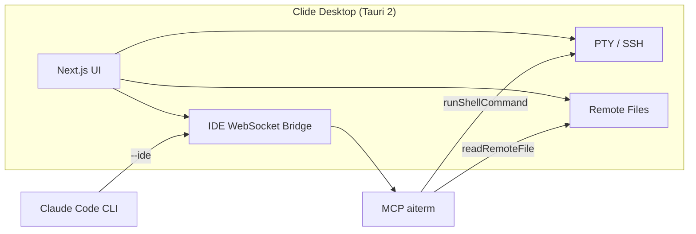

<p align="center">
  
</p>

<h1 align="center">Clide</h1>

<p align="center">
  <strong>智能终端 · AI SSH Terminal &amp; Claude Code IDE Desktop App</strong><br>
  面向开发者的 SSH 终端工作台：Shell、远程文件、Monaco 编辑器与 Claude Code AI 助手，一站式远程开发与 AI 编程。
</p>

<p align="center">
  <a href="https://github.com/DLbury/clide/releases"></a>
  <a href="https://github.com/DLbury/clide/actions/workflows/release.yml"></a>
  <a href="https://github.com/DLbury/clide/actions/workflows/ci.yml"></a>
  <a href="LICENSE"></a>
  
</p>

<p align="center">
  <a href="https://github.com/DLbury/clide/releases"><strong>⬇️ 下载安装包</strong></a>
  &nbsp;·&nbsp;
  <a href="#快速开始">快速开始</a>
  &nbsp;·&nbsp;
  <a href="#claude-code--mcp-集成">Claude Code 集成</a>
  &nbsp;·&nbsp;
  <a href="#从源码构建">源码构建</a>
</p>

---

## 简介

**Clide**（clide / AITERM）是一款基于 [Tauri 2](https://v2.tauri.app/) 的跨平台桌面应用，将 **SSH 终端**、**远程文件管理**、**代码编辑** 与 **[Claude Code](https://docs.anthropic.com/en/docs/claude-code) AI 编程助手** 整合在同一窗口。

通过 **非侵入式 IDE 桥接** 与 **MCP（Model Context Protocol）** 工具，Claude 可以直接在你的 SSH 会话中执行命令、读取终端上下文、浏览远程文件——无需修改系统 shell 配置，也不污染 `~/.bashrc` 或 PowerShell Profile。

<p align="center">
  
</p>

> 关键词：**SSH 客户端** · **AI 终端** · **Claude Code IDE** · **MCP 工具** · **远程开发** · **xterm.js** · **Monaco Editor** · **Tauri 桌面应用**

---

## 目录

- [功能特性](#功能特性)
- [下载安装](#下载安装)
- [快速开始](#快速开始)
- [Claude Code & MCP 集成](#claude-code--mcp-集成)
- [MCP 工具列表](#mcp-工具列表)
- [架构概览](#架构概览)
- [从源码构建](#从源码构建)
- [项目结构](#项目结构)
- [发布说明](#发布说明)
- [技术栈](#技术栈)
- [License](#license)

---

## 功能特性

<table>
<tr>
<td width="50%" valign="top">

### 🖥️ SSH 终端

- 多标签 Shell、Dockview 分屏布局
- xterm.js 实时 PTY（本地 PowerShell / 远程 SSH）
- 会话分组、配置持久化
- 启动时自动打开本地 Shell

</td>
<td width="50%" valign="top">

### 📁 远程文件

- SFTP 目录浏览、上传/下载
- 拖拽移动、批量操作
- Root 模式（sudo 提权操作）
- 与 Monaco 编辑器联动打开/保存

</td>
</tr>
<tr>
<td valign="top">

### 📊 资源监控

- SSH 连接后自动采集 CPU、内存、显存、磁盘
- 独立 exec 通道，不干扰 PTY 交互

</td>
<td valign="top">

### 🤖 Claude Code AI

- 流式对话、推理过程与工具调用可视化
- 终端上下文自动注入 AI
- 发送/停止生成、全文复制
- 密码提示在 Shell 面板输入（sudo / SSH）

</td>
</tr>
</table>

<p align="center">
  
  &nbsp;&nbsp;
  
  &nbsp;&nbsp;
  
</p>

---

## 下载安装

在 **[Releases](https://github.com/DLbury/clide/releases)** 页面下载最新版安装包：

| 平台 | 格式 | 说明 |
|------|------|------|
| **Windows** | `.msi` / `.exe` | 需 WebView2（Win10/11 通常已自带） |
| **macOS** | `.dmg` | Apple Silicon（`aarch64`）与 Intel（`x86_64`）分别构建 |
| **Linux** | `.deb` / `.AppImage` | 需 WebKitGTK 等依赖（见下方源码构建） |

### 前置条件

| 组件 | 用途 |
|------|------|
| [Claude Code CLI](https://docs.anthropic.com/en/docs/claude-code) | AI 对话与 MCP 工具（需登录 Anthropic 账号） |
| Node.js 20+ | 仅源码构建 / MCP stdio 脚本需要 |

---

## 快速开始

1. **安装** — 从 [Releases](https://github.com/DLbury/clide/releases) 下载并安装 Clide
2. **配置 SSH** — 在侧边栏添加服务器 Profile（主机、端口、用户名、密钥）
3. **连接 Shell** — 双击 Profile 打开 SSH 终端标签
4. **启用 AI** — 确保本机已安装并登录 Claude Code CLI，在右侧 AI 面板发送消息
5. **远程执行** — 对 AI 说「在这台服务器上执行 `df -h`」，Claude 将通过 MCP 调用 `runShellCommand`

```
示例对话：
  你：查看当前聚焦服务器的磁盘使用情况
  AI：→ getFocusedServer → runShellCommand("df -h") → 返回终端输出
```

---

## Claude Code & MCP 集成

Clide 采用 **非侵入式** 集成策略，不修改你的全局 Claude 配置：

| 方式 | 说明 |
|------|------|
| **IDE 桥接** | 启用 AI 后在 `127.0.0.1` 启动 WebSocket 桥接，写入 `~/.claude/ide/*.lock` |
| **应用内对话** | 启动 Claude 时注入 `--ide` 与 MCP 配置 |
| **项目 MCP** | 仓库含 [`.mcp.json`](.mcp.json)，可通过设置页「手动注册 MCP」 |

<p align="center">
  
</p>

<details>
<summary><strong>独立使用 Claude Code CLI 时</strong></summary>

1. 先启动 Clide 并保持 IDE 桥接连接，或
2. 在项目目录执行 `claude mcp add -s project` 注册 MCP（参见 [`.mcp.json`](.mcp.json)）

</details>

---

## MCP 工具列表

`aiterm` MCP 服务器暴露以下工具，供 Claude Code 在 IDE 模式下调用：

| 工具 | 功能 |
|------|------|
| `listServerProfiles` | 列出所有 SSH Profile |
| `listActiveConnections` | 列出当前活跃连接 |
| `getFocusedServer` | 获取当前聚焦的服务器 `profileId` |
| `getTerminalContext` | 读取终端最近输出 |
| `connectServer` / `disconnectServer` | 连接 / 断开 SSH |
| `runShellCommand` | 在指定 Profile 的 PTY 中执行命令 |
| `listRemoteFiles` / `readRemoteFile` | 浏览 / 读取远程文件 |
| `getWorkspaceFolders` / `getOpenFiles` | 工作区与打开文件 |
| `getCurrentSelection` | 编辑器当前选区 |

> `profileId` 必须使用工具返回的稳定 ID，**不要**使用会话名称、主机名或 shellId。

---

## 架构概览



---

## 从源码构建

### 环境要求

- [Node.js](https://nodejs.org/) 20+
- [Rust](https://rustup.rs/) stable
- 平台依赖见 [Tauri Prerequisites](https://v2.tauri.app/start/prerequisites/)

### 开发模式

```bash
git clone https://github.com/DLbury/clide.git
cd clide

npm ci
npm ci --prefix view

# Next.js 热更新 + Tauri 桌面窗口
npm run dev:tauri
```

### 生产构建

```bash
npm ci
npm ci --prefix view
npm run build:tauri
```

安装包输出目录：`src-tauri/target/release/bundle/`

### 生成圆角图标

```bash
node scripts/generate-rounded-icons.mjs
```

---

## 项目结构

```
clide/
├── view/              # Next.js 前端（React、Tailwind、xterm、Monaco、Dockview）
├── src-tauri/         # Rust / Tauri 后端（SSH、PTY、Claude 桥接、MCP）
├── scripts/           # MCP stdio 转发脚本
├── docs/assets/       # README 配图
├── .mcp.json          # Claude Code 项目级 MCP 配置
└── package.json       # Tauri CLI 入口
```

---

## 发布说明

### 首次启用 GitHub Actions

1. 仓库 **Settings → Actions → General**
2. **Actions permissions** → Allow all actions
3. **Workflow permissions** → Read and write permissions
4. 若出现「Approve workflows」横幅，点击批准

### 打标签发布

```bash
git tag v0.1.21
git push origin v0.1.21
```

也可在 [Actions](https://github.com/DLbury/clide/actions) 页手动运行 **Release** 工作流。工作流定义见 [`.github/workflows/release.yml`](.github/workflows/release.yml)。

---

## 技术栈

| 层级 | 技术 |
|------|------|
| 桌面壳 | Tauri 2、Rust（russh、portable-pty） |
| 前端 | Next.js、React、Tailwind CSS、xterm.js、Monaco、Dockview |
| AI | Claude Code CLI、MCP、WebSocket IDE 协议 |

---

## License

本项目采用 [MIT License](LICENSE) 开源。

Copyright © 2026 [DLbury](https://github.com/DLbury)

---

<p align="center">
  <sub>
    Clide · AI SSH Terminal · Claude Code IDE · MCP Remote Development<br>
    如果这个项目对你有帮助，欢迎 ⭐ Star 支持
  </sub>
</p>
