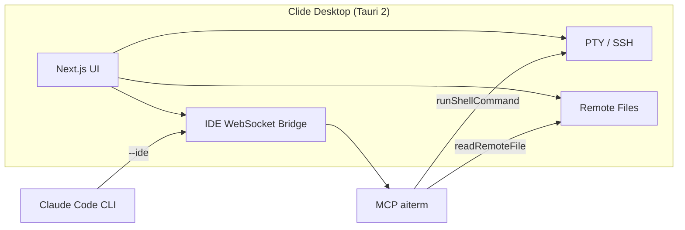

<p align="center">
  
</p>

<h1 align="center">Clide</h1>

<p align="center">
  <strong>AI SSH Terminal &amp; Claude Code IDE Desktop App</strong><br>
  A developer workstation that combines Shell, remote file management, Monaco editor, and Claude Code AI in one window.
</p>

<p align="center">
  <a href="README_ZH.md"></a>
  <a href="https://github.com/DLbury/clide/releases"></a>
  <a href="https://github.com/DLbury/clide/actions/workflows/release.yml"></a>
  <a href="LICENSE"></a>
  
</p>

<p align="center">
  <a href="https://github.com/DLbury/clide/releases"><strong>Download</strong></a>
  | <a href="#quick-start">Quick Start</a>
  | <a href="#claude-code--mcp-integration">Claude Code</a>
  | <a href="#build-from-source">Build from Source</a>
</p>

---

## Introduction

**Clide** is a cross-platform desktop app built on [Tauri 2](https://v2.tauri.app/) that brings together an **SSH terminal**, **remote file manager**, **code editor**, and **[Claude Code](https://docs.anthropic.com/en/docs/claude-code) AI assistant** in a single window.

Through a **non-invasive IDE bridge** and **MCP (Model Context Protocol)** tools, Claude can execute commands directly in your SSH sessions, read terminal context, and browse remote files -- without touching your shell config or polluting `~/.bashrc` or your PowerShell Profile.

<p align="center">
  
</p>


## Demo

> **TODO**: Record a 30-60s demo GIF showing SSH connection -> AI executing commands -> remote file editing.
>
> Suggested tools: [ScreenToGif](https://www.screentogif.com/), [Kap](https://getkap.co/), [LICEcap](https://www.cockos.com/licecap/)
>
> Target flow:
> 1. Open Clide, connect to a remote SSH server
> 2. Ask Claude Code AI: "Check disk usage on this server"
> 3. Claude calls `runShellCommand("df -h")` via MCP
> 4. Open a remote file in Monaco editor
> 5. Edit and save back via SFTP

> Keywords: **SSH client** | **AI terminal** | **Claude Code IDE** | **MCP tools** | **remote development** | **xterm.js** | **Monaco Editor** | **Tauri desktop app**

---


## Why Clide?

| Feature | Clide | Warp | Tabby | Cursor | iTerm2 |
|------|:------:|:----:|:-----:|:------:|:------:|
| SSH native support | Yes | Yes | Yes | No | No |
| Claude Code integration (MCP) | Yes | No | No | No | No |
| Remote file management (SFTP) | Yes | No | No | No | No |
| Monaco code editor | Yes | No | No | Yes | No |
| Resource monitoring | Yes | No | No | No | No |
| Open source (MIT) | Yes | No | Yes | No | No |
| Cross-platform | Yes | No | Yes | Yes | No |
| Lightweight (Tauri) | Yes | No | No | No | No |

## Features

<table>
<tr>
<td width="50%" valign="top">

### SSH Terminal

- Multi-tab shells with Dockview split-pane layout
- Real-time PTY via xterm.js (local PowerShell / remote SSH)
- Session grouping, persistent configuration
- Auto-opens local shell on startup

</td>
<td width="50%" valign="top">

### Remote Files

- SFTP directory browsing, upload/download
- Drag-and-drop moves, batch operations
- Root mode (sudo elevated operations)
- Open/save files directly in Monaco editor

</td>
</tr>
<tr>
<td valign="top">

### Resource Monitoring

- Auto-collects CPU, memory, GPU memory, and disk after SSH connection
- Independent exec channel, no interference with PTY

</td>
<td valign="top">

### Claude Code AI

- Streaming chat with reasoning and tool call visualization
- Terminal context auto-injected into AI
- Send/stop generation, full-text copy
- Password prompts handled in Shell panel (sudo / SSH)

</td>
</tr>
</table>

---

## Download

From **[Releases](https://github.com/DLbury/clide/releases)**:

| Platform | Format | Notes |
|------|------|------|
| **Windows** | `.msi` / `.exe` | Requires WebView2 (Win10/11 pre-installed) |
| **macOS** | `.dmg` | Apple Silicon (`aarch64`) and Intel (`x86_64`) |
| **Linux** | `.deb` / `.AppImage` | Requires WebKitGTK (see below) |

### Linux Troubleshooting

No window after install? Run from terminal:

```bash
clide
# Or AppImage
chmod +x Clide_*.AppImage && ./Clide_*.AppImage
```

Missing libraries on Ubuntu/Debian:

```bash
sudo apt install -y libwebkit2gtk-4.1-0 libgtk-3-0 libayatana-appindicator3-1
```

Wayland issues: `GDK_BACKEND=x11 clide`

### Prerequisites

| Component | Purpose |
|------|------|
| [Claude Code CLI](https://docs.anthropic.com/en/docs/claude-code) | AI chat and MCP tools |
| Node.js 20+ | Source builds / MCP stdio only |

---

## Quick Start

1. **Install** -- Download from [Releases](https://github.com/DLbury/clide/releases)
2. **Configure SSH** -- Add server profiles in the sidebar
3. **Connect Shell** -- Double-click a profile to open SSH terminal
4. **Enable AI** -- Ensure Claude Code CLI is installed, send a message in the AI panel
5. **Remote Execute** -- Tell the AI "run `df -h` on this server"

```
Example:
  You: Show disk usage on the focused server
  AI:  -> getFocusedServer -> runShellCommand("df -h") -> returns output
```

---

## Claude Code & MCP Integration

Non-invasive integration -- no global Claude config changes:

| Method | Description |
|------|------|
| **IDE Bridge** | WebSocket on `127.0.0.1`, writes `~/.claude/ide/*.lock` |
| **In-App Chat** | Injects `--ide` and MCP config on launch |
| **Project MCP** | Use [`.mcp.json`](.mcp.json), register via Settings |

<p align="center">
  
</p>

---

## MCP Tools

| Tool | Description |
|------|------|
| `listServerProfiles` | List all SSH profiles |
| `listActiveConnections` | List active connections |
| `getFocusedServer` | Get focused server `profileId` |
| `getTerminalContext` | Read recent terminal output |
| `connectServer` / `disconnectServer` | Connect / disconnect SSH |
| `runShellCommand` | Execute command in profile PTY |
| `listRemoteFiles` / `readRemoteFile` | Browse / read remote files |
| `getWorkspaceFolders` / `getOpenFiles` | Workspace and open files |
| `getCurrentSelection` | Current editor selection |

---

## Architecture



---

## Build from Source

Requirements: [Node.js](https://nodejs.org/) 20+, [Rust](https://rustup.rs/) stable, [Tauri Prerequisites](https://v2.tauri.app/start/prerequisites/)

```bash
git clone https://github.com/DLbury/clide.git
cd clide
npm ci && npm ci --prefix view
npm run dev:tauri    # Development
npm run build:tauri  # Production
```

Output: `src-tauri/target/release/bundle/`

---

## Project Structure

```
clide/
+-- view/          # Next.js frontend (React, Tailwind, xterm, Monaco, Dockview)
+-- src-tauri/     # Rust / Tauri backend (SSH, PTY, Claude bridge, MCP)
+-- scripts/       # MCP stdio scripts
+-- docs/assets/   # README images
+-- .mcp.json      # Claude Code project MCP config
+-- package.json   # Tauri CLI entry
```

---

## Tech Stack

| Layer | Technology |
|------|------|
| Desktop Shell | Tauri 2, Rust (russh, portable-pty) |
| Frontend | Next.js, React, Tailwind CSS, xterm.js, Monaco, Dockview |
| AI | Claude Code CLI, MCP, WebSocket IDE protocol |

---

## License

[MIT License](LICENSE) -- Copyright 2026 [DLbury](https://github.com/DLbury)

---

<p align="center">
  <sub>Clide | AI SSH Terminal | Claude Code IDE | MCP Remote Development<br>Star this repo if you find it helpful!</sub>
</p>
