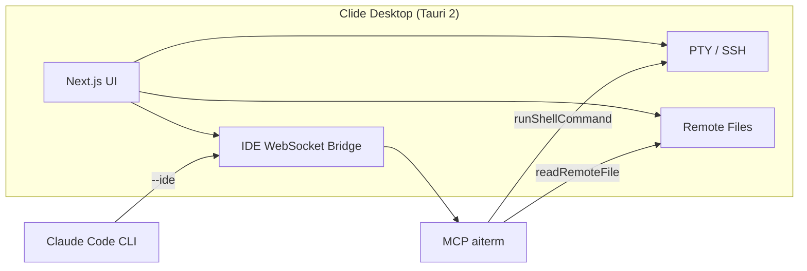

<p align="center">
  
</p>


<p align="center">
  <a href="README.md"></a>
  &nbsp;
  <a href="README_ZH.md"></a>
</p>


<h1 align="center">Clide</h1>

<p align="center">
  <em>生产级 <strong>AI 终端工具</strong> — SSH、SFTP、跳板机与原生 Claude Code 一体，凭据留在终端、不进 AI 对话</em>
</p>

<p align="center">
  <a href="https://github.com/DLbury/clide/releases"></a>
  <a href="https://github.com/DLbury/clide/actions/workflows/release.yml"></a>
  <a href="https://github.com/DLbury/clide/actions/workflows/ci.yml"></a>
  <a href="LICENSE"></a>
  
</p>

<p align="center">
  <a href="https://github.com/DLbury/clide/releases"><strong>⬇️ 下载安装包</strong></a>
  &nbsp;·&nbsp;
  <a href="#快速开始">快速开始</a>
  &nbsp;·&nbsp;
  <a href="#claude-code--mcp-集成">Claude Code 集成</a>
  &nbsp;·&nbsp;
  <a href="#从源码构建">源码构建</a>
</p>

---

## 简介

**Clide 是生产级 AI 终端工具**，支持 Windows、macOS、Linux — 多标签 SSH Shell、SFTP、跳板机、布局快照、多机同步与资源监控，**原生集成 Claude Code**。终端是操作界面，AI 读取实时 PTY、在同一 Shell 里跑命令。

不是给聊天窗口挂个终端。SSH 密码、私钥与 sudo 提示 **永远不进入 AI 路径**。

### 为什么你需要 Clide？

用 Claude Code 处理服务器问题时，你是不是一直被这些安全问题困扰？

❌ **必须给每台服务器配置 AI 的公钥**，一旦 AI 端泄露，所有服务器全部沦陷  
❌ **必须把明文密码告诉 Claude**，密码会上传到 Anthropic 服务器  
❌ **Sudo 命令无法执行**，要么配置无密码 sudo（安全红线），要么把 root 密码交给 AI  

Clide 采用 **本地中转架构** 完美解决这些问题：

✅ SSH 连接完全由本地客户端建立和维护  
✅ 你的密码和私钥永远只存在于你的电脑上，**永远不会上传到任何第三方**  
✅ AI 执行 sudo 命令时，你在左侧 Shell 输入密码（SSH 登录可在本地弹窗输入），**不会传递给 Claude**  
✅ 不需要在任何服务器上安装任何软件或配置额外公钥  

Claude Code **只在你本机运行**，通过 **IDE 桥接 + MCP** 把命令下发到 **左侧真实 SSH Shell**（与手动敲命令同一条 PTY），AI 读终端输出帮你分析。

同一窗口还提供多会话 SSH 终端、SFTP 文件浏览、资源监控与 Monaco 编辑远程配置，适合日常巡检、故障定位与变更操作。

<p align="center">
  
</p>

<p align="center"><strong>Clide</strong> 是生产级 AI 终端工具 — 真实 SSH Shell 与原生 Claude Code 一体，让 SRE 与后端工程师放心做 AI 驱动运维，<em>而无需交出密码、私钥或 root</em>。</p>

### 👤 谁适合用？

- **SRE / DevOps / 平台工程师**：日常要敲 `sudo`、看日志、在大量机器上救火，想让 AI 帮忙又不想泄露凭据。
- **后端工程师**：SSH 进生产排查服务问题，想让 Claude 跟你一起读实时终端输出。
- **对安全敏感的团队**：不能（或不愿）给每台服务器分发 AI 公钥，也不愿把 root 密码贴进对话框。

> 🎬 **看它在动** —— 60 秒演示 AI 驱动左侧 Shell 的录像见 [docs/demo-recording.md](docs/demo-recording.md)。（录像位已就绪，把 `docs/assets/demo.gif` 放进去即可在此处内嵌。）

> 关键词：**运维终端** · **AI 排障** · **Claude Code** · **MCP** · **SSH** · **sudo 安全** · **SRE** · **Tauri 桌面应用**

### 🔄 Clide 与其他方案对比

| | SSH 客户端 + 另开一个 Claude 窗口 | Claude Code 直连 SSH | **Clide** |
|---|---|---|---|
| AI 能看到实时终端输出 | ❌ 靠手工复制粘贴 | ✅ 可以 | ✅ 可以，和你敲命令同一条 PTY |
| 服务器凭据 | ✅ 留在你手里 | ❌ 每台机器放公钥或密码给 AI | ✅ 留在你手里，AI 不接触 |
| `sudo` / 二次验证 | ✅ 你自己处理 | ❌ 难以安全交互 | ✅ 左侧 Shell 输入，AI 看不到 |
| 服务器上装 agent / 额外公钥 | ✅ 不需要 | ❌ 必需 | ✅ 不需要 |
| Shell + 文件 + AI 同一窗口 | ❌ 否 | ⚠️ 部分 | ✅ 是 |

Clide 保留了**传统 SSH 客户端的安全模型**，同时拥有**直连 Claude Code 的 AI 上下文**——且不暴露凭据。

---

## 目录

- [功能特性](#功能特性)
- [下载安装](#下载安装)
- [快速开始](#快速开始)
- [Claude Code & MCP 集成](#claude-code--mcp-集成)
- [MCP 工具列表](#mcp-工具列表)
- [架构概览](#架构概览)
- [从源码构建](#从源码构建)
- [项目结构](#项目结构)
- [发布说明](#发布说明)
- [技术栈](#技术栈)
- [License](#license)

---

## 功能特性

### 终端核心

<table>
<tr>
<td width="50%" valign="top">

**SSH 终端**

- 多标签 Shell、Dockview 分屏、会话分组
- xterm.js 实时 PTY（本地 PowerShell / 远程 SSH）
- **布局快照** — 保存/恢复完整工作区（各 Shell 独立 cwd）；加载时自动重连
- **多机同步输入** — 选中多台服务器，一个 tab 各开一个 Shell，按键/粘贴同步广播
- 命令历史、**终端录制**（asciicast 导出）
- 面板布局记忆（侧边栏、文件树、AI 面板折叠状态）

</td>
<td width="50%" valign="top">

**连接与群运维**

- **多级跳板机**（ProxyJump），逐跳独立凭据
- SOCKS 代理、Telnet
- 持久化服务器 Profile，启动时自动打开本地 Shell
- **Windows 免安装版** — `*-portable.zip`，解压运行 `clide.exe`

</td>
</tr>
</table>

### 运维工具包

<table>
<tr>
<td width="50%" valign="top">

### 📁 远程文件

- SFTP 目录浏览、上传/下载
- 拖拽移动、批量操作
- Root 模式（sudo 提权操作）
- 与 Monaco 编辑器联动打开/保存

</td>
<td width="50%" valign="top">

### 📊 资源监控

- SSH 连接后自动采集 CPU、内存、显存、磁盘
- 独立 exec 通道，不干扰 PTY 交互

</td>
</tr>
</table>

### AI 能力（内置）

<table>
<tr>
<td width="50%" valign="top">

### 🤖 Claude Code 与多 AI 后端

- **Claude Code**、Codex、OpenCode、Cursor Agent — 设置中切换
- 本机 CLI + MCP：`runShellCommand` 驱动左侧 Shell，非 AI 直连 SSH
- 流式对话、工具调用与终端输出回传
- **命令审批** — 破坏性/敏感命令执行前人工确认
- 多线程 Agent 对话；上次对话非空时启动自动新建空线程

</td>
<td width="50%" valign="top">

### 🔒 安全 AI 边界

- **密码边界清晰**：SSH / sudo 仅在左侧 xterm 输入，AI 不索要、不嵌入命令
- MCP 只操作你已打开的会话 — 服务器无需 agent
- 长任务可轮询 `getTerminalContext`；终端上下文可注入对话

</td>
</tr>
</table>

### 近期亮点（v0.1.76+）

| 功能 | 说明 |
|------|------|
| 布局快照 | 保存前探测各 Shell 真实 cwd；一键重连并恢复分屏 |
| 多机同步输入 | 选服务器 → 各开一个 Shell → 敲一次、全部同步 |
| 同步组平铺 | 创建同步组时自动平铺各 Shell 窗口 |
| 面板记忆 | 侧边栏 / 文件树 / AI 面板折叠状态跨重启保留 |
| Windows 免安装 | `*-portable.zip`，解压即用 |

<p align="center">
  
  &nbsp;&nbsp;
  
  &nbsp;&nbsp;
  
</p>

---

## 下载安装

在 **[Releases](https://github.com/DLbury/clide/releases)** 页面下载最新版安装包：

| 平台 | 格式 | 说明 |
|------|------|------|
| **Windows** | `.exe` 安装包 / `*-portable.zip` | 需 WebView2（Win10/11 通常已自带）。免安装版：解压运行 `clide.exe` |
| **macOS** | `.dmg` | Apple Silicon（`aarch64`）与 Intel（`x86_64`）分别构建；v0.1.20 及更早版本存在与 Linux 相同的 MCP 启动问题，请用 v0.1.21+ |
| **Linux** | `.deb` / `.AppImage` | 需 WebKitGTK 等依赖（见下方 [Linux 故障排除](#linux-故障排除)） |

### Linux 故障排除

> **v0.1.20 及更早的 `.deb`**：若安装后无窗口，多为 MCP 资源路径错误导致启动即退出；请使用 **v0.1.21+** 的 `.deb` 重新安装。

安装后**没有窗口**或**点击无反应**时，请在终端运行（便于看到错误信息）：

```bash
# .deb 安装后（二进制一般在 /usr/bin，资源在 /usr/lib/Clide/）
clide

# 或 AppImage
chmod +x Clide_*.AppImage
./Clide_*.AppImage
```

若提示缺少库，Ubuntu/Debian 可安装：

```bash
sudo apt update
sudo apt install -y \
  libwebkit2gtk-4.1-0 \
  libgtk-3-0 \
  libayatana-appindicator3-1
```

Wayland 下若窗口仍异常，可尝试 X11 会话，或：

```bash
GDK_BACKEND=x11 clide
```

调试日志：

```bash
RUST_LOG=debug clide
```

### 前置条件

| 组件 | 用途 |
|------|------|
| [Claude Code CLI](https://docs.anthropic.com/en/docs/claude-code) | AI 对话与 MCP 工具（需登录 Anthropic 账号） |
| Node.js 20+ | 仅源码构建 / MCP stdio 脚本需要 |

---

## 快速开始

1. **安装** — 从 [Releases](https://github.com/DLbury/clide/releases) 下载（Windows 可选安装包或 portable zip）
2. **配置 SSH** — 侧边栏添加服务器 Profile（主机、端口、用户、密钥或密码——凭据留在应用内，不给 AI）
3. **连接 Shell** — 双击 Profile，在 **左侧终端** 完成登录（含密码 / 二次验证）。分屏、SFTP、监控均可使用
4. **启用 AI** — 本机安装并登录 [Claude Code CLI](https://docs.anthropic.com/en/docs/claude-code)，确认侧栏 IDE 桥接已就绪
5. **AI 运维** — 对 AI 描述现象，例如「查看这台机磁盘和负载」；Claude 调用 `runShellCommand`，你在左侧看到命令与输出，需要 `sudo` 时在 Shell 里输入密码

```
示例：
  你：这台机器磁盘快满了，帮我查一下
  AI：→ runShellCommand("df -h") → 左侧 Shell 执行并回传输出
  AI：→ runShellCommand("sudo du -sh /var/* | sort -rh | head") 
  你：在左侧 Shell 输入 sudo 密码（AI 看不到）
```

---

## Claude Code & MCP 集成

Clide 让 Claude Code 扮演 **本机运维副驾驶**：它不持有你的 SSH 凭据，只通过 MCP 操作你已打开的 Shell 会话。

| 对比 | Claude Code 直连 SSH | Clide |
|------|---------------------|-------|
| Claude 安装位置 | 本机或每台服务器 | **仅本机** |
| 服务器凭据 | 公钥分发或密码给 AI | **你在 UI 登录，AI 不接触** |
| `sudo` | 难安全交互 | **左侧 Shell 手动输入** |
| 命令可见性 | 视工具而定 | **与手工操作同一 xterm** |

集成采用 **非侵入式** 策略，不修改全局 shell 配置：

| 方式 | 说明 |
|------|------|
| **IDE 桥接** | 启用 AI 后在 `127.0.0.1` 启动 WebSocket 桥接，写入 `~/.claude/ide/*.lock` |
| **应用内对话** | 启动 Claude 时注入 `--ide` 与 MCP 配置 |
| **项目 MCP** | 仓库含 [`.mcp.json`](.mcp.json)，可通过设置页「手动注册 MCP」 |

<p align="center">
  
</p>

<details>
<summary><strong>独立使用 Claude Code CLI 时</strong></summary>

1. 先启动 Clide 并保持 IDE 桥接连接，或
2. 在项目目录执行 `claude mcp add -s project` 注册 MCP（参见 [`.mcp.json`](.mcp.json)）

</details>

---

## MCP 工具列表

`aiterm` MCP 服务器暴露以下工具，供 Claude Code 在 IDE 模式下调用：

| 工具 | 功能 |
|------|------|
| `listServerProfiles` | 列出所有 SSH Profile |
| `listActiveConnections` | 列出当前活跃连接 |
| `getFocusedServer` | 获取当前聚焦的服务器 `profileId` |
| `getTerminalContext` | 读取终端最近输出 |
| `connectServer` / `disconnectServer` | 连接 / 断开 SSH |
| `runShellCommand` | 在指定 Profile 的 PTY 中执行命令 |
| `listRemoteFiles` / `readRemoteFile` | 浏览 / 读取远程文件 |
| `getWorkspaceFolders` / `getOpenFiles` | 工作区与打开文件 |
| `getCurrentSelection` | 编辑器当前选区 |

> `profileId` 必须使用工具返回的稳定 ID，**不要**使用会话名称、主机名或 shellId。

---

## 架构概览



---

## 从源码构建

### 环境要求

- [Node.js](https://nodejs.org/) 20+
- [Rust](https://rustup.rs/) stable
- 平台依赖见 [Tauri Prerequisites](https://v2.tauri.app/start/prerequisites/)

### 开发模式

```bash
git clone https://github.com/DLbury/clide.git
cd clide

npm ci
npm ci --prefix view

# Next.js 热更新 + Tauri 桌面窗口
npm run dev:tauri
```

### 生产构建

```bash
npm ci
npm ci --prefix view
npm run build:tauri
```

安装包输出目录：`src-tauri/target/release/bundle/`

### 生成圆角图标

```bash
node scripts/generate-rounded-icons.mjs
```

---

## 项目结构

```
clide/
├── view/              # Next.js 前端（React、Tailwind、xterm、Monaco、Dockview）
├── src-tauri/         # Rust / Tauri 后端（SSH、PTY、Claude 桥接、MCP）
├── scripts/           # MCP stdio 转发脚本
├── docs/assets/       # README 配图
├── .mcp.json          # Claude Code 项目级 MCP 配置
└── package.json       # Tauri CLI 入口
```

---

## 发布说明

### 首次启用 GitHub Actions

1. 仓库 **Settings → Actions → General**
2. **Actions permissions** → Allow all actions
3. **Workflow permissions** → Read and write permissions
4. 若出现「Approve workflows」横幅，点击批准

### 打标签发布

```bash
git tag v0.1.21
git push origin v0.1.21
```

也可在 [Actions](https://github.com/DLbury/clide/actions) 页手动运行 **Release** 工作流。工作流定义见 [`.github/workflows/release.yml`](.github/workflows/release.yml)。

---

## 技术栈

| 层级 | 技术 |
|------|------|
| 桌面壳 | Tauri 2、Rust（russh、portable-pty） |
| 前端 | Next.js、React、Tailwind CSS、xterm.js、Monaco、Dockview |
| AI | Claude Code CLI、MCP、WebSocket IDE 协议 |

---

## License

本项目采用 [MIT License](LICENSE) 开源。

Copyright © 2026 [DLbury](https://github.com/DLbury)

---

## Star History

<p align="center">
  <a href="https://star-history.com/#DLbury/clide&Date">
    
  </a>
</p>

---

<p align="center">
  <sub>
    Clide · 生产级 AI 终端 · Claude Code · 安全 SSH &amp; sudo<br>
    如果 Clide 帮你少熬一个通宵救火，欢迎 ⭐ <strong>Star</strong> 这个仓库，<br>
    并把它分享给身边还在往对话框里粘贴 root 密码的运维同学。
  </sub>
</p>
